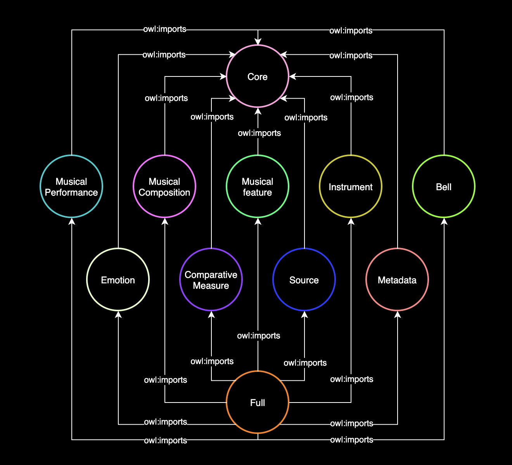

# Knowledge Engineering project
Team “Antonio & Daniele”:
- Antonio Politano <antonio.politano2@studio.unibo.it>
- Daniele Santini <daniele.santini2@studio.unibo.it>

## Assignment
Project 4 - Matching ontologies in the music domain
Tutor: 
- Valentina Carriero <valentina.carriero3@unibo.it>
- Jacopo de Berardinis <jacopo.deberardinis@kcl.ac.uk>
- Valentina Presutti <valentina.presutti@unibo.it>

### General tasks
From [Projects2223.pdf](./Projects2223.pdf), page 5
1.	Analysis of existing datasets using heterogeneous formats, to produce RDF knowledge graphs
2. Application of the eXtreme Design methodology (competency questions, ODP reuse, testing, etc.) to develop OWL ontologies for the knowledge graphs
3. Definition of mapping rules for transforming input data into semantic web knowledge graphs, according to the developed ontologies (e.g., SPARQLAnything)
4. Generation of URIs and publication of ontologies and knowledge graphs (with permanent URIs)
5. Application/use/configuration of tools for entity linking and ontology alignment
6. Use of large language models
7. Publication of a SPARQL endpoint
8. Integration of LODView for knowledge graph browsing and LODE for producing human-readable documentation of the ontologies Ex. https://github.com/anuzzolese/OntoPiA-UI
9. Creation of a docker that will contain data, software, SPARQL endpoint, website and all the necessary dependencies
10. Report writing with a description of the project, remarking the applied methodology, the addressed the challenges, the adopted solutions, and the obtained results.

### Project assignment
From [Projects2223.pdf](./Projects2223.pdf), page 18

In the Polifonia project, we are developing a network of ontologies on the music domain.
This ontology network (PON, [link](https://github.com/polifonia-project/ontology-network/)) is composed of different ontology modules, addressing a specific thematic area of the domain (e.g. a module is specifically related to bells and bell towers).

In order to support interoperability, such ontologies should be aligned to existing (music-related) ontologies.
Ontology matching (OM) can be defined as the process of finding correspondences (i.e. mappings, alignments) between entities belonging to different ontologies.

In this project, you will generate a set of alignments between the modules developed inside Polifonia and relevant state-of-the-art ontologies.

Relevant ontologies to be aligned to PON can be found in this deliverable ([link](https://polifonia-project.eu/wp-content/uploads/2022/01/Polifonia_D2.1_V1.0.pdf), [backup](./Polifonia_D2.1_V1.0.pdf)), section 6.2

## Observations on the ontology
Observations on the [Polifonia ontology specification](./Polifonia_D2.1_V1.0.pdf) and [the repo](https://github.com/polifonia-project/ontology-network/)

15 ontology modules:

From [the spec](./Polifonia_D2.1_V1.0.pdf), page 13, and [the top level ontology](https://github.com/polifonia-project/ontology-network/blob/5e90aefa25217547eddd4816bdae719b0e52daac/ontology/ontology-network.owl)

Ontology Module | Prefix | Declared repository | Actual repository | URI
-----|-----|-----|-----|-----
Full | full: | [ontology-network](https://github.com/polifonia-project/ontology-network) | [ontology-network](https://github.com/polifonia-project/ontology-network) | https://w3id.org/polifonia/ontology/ontology-network/1.0/
Core | core: | [core](https://github.com/polifonia-project/core) | [core-ontology](https://github.com/polifonia-project/core-ontology) | https://w3id.org/polifonia/ontology/core/
Musical Composition | mc: | [musical-composition](https://github.com/polifonia-project/musical-composition) | ??? | ???
Musical Performance | mp: | [musical-performance](https://github.com/polifonia-project/musical-performance) | ??? | ???
Musical Feature | mf: | [musical-feature](https://github.com/polifonia-project/musical-feature) | ??? | ???
Music Emotion | me: | [music-emotion](https://github.com/polifonia-project/music-emotion) | [music-emotion-ontology](https://github.com/polifonia-project/music-emotion-ontology) | ???
Bell | bell: | [bell](https://github.com/polifonia-project/bell) | [bells-ontology](https://github.com/polifonia-project/bells-ontology) | https://w3id.org/polifonia/ontology/bells/
Source | src: | [source](https://github.com/polifonia-project/source) | [source-ontology](https://github.com/polifonia-project/source-ontology) | https://w3id.org/polifonia/ontology/source/
Instrument | inst: | [instrument](https://github.com/polifonia-project/instrument) | [music-instrument-ontology](https://github.com/polifonia-project/music-instrument-ontology) | https://w3id.org/polifonia/ontology/instrument/
Comparative Measure | cm: | [comparative-measure/](https://github.com/polifonia-project/comparative-measure/) | ??? | ???
Metadata | md: | [metadata](https://github.com/polifonia-project/metadata) | [cometa-ontology](https://github.com/polifonia-project/cometa-ontology) | https://w3id.org/polifonia/ontology/cometa/
Music Annotation | ? | NO | [music-annotation-ontology](https://github.com/polifonia-project/music-annotation-ontology) | https://w3id.org/polifonia/ontology/music-annotation/
Music Algorithm | ? | NO | [music-algorithm-ontology](https://github.com/polifonia-project/music-algorithm-ontology) | https://w3id.org/polifonia/ontology/music-algorithm/
Music Analysis | ? | NO | [music-analysis-ontology](https://github.com/polifonia-project/music-analysis-ontology) | https://w3id.org/polifonia/ontology/music-analysis/
Music Projection | ? | NO | [music-projection-ontology](https://github.com/polifonia-project/music-projection-ontology) | https://w3id.org/polifonia/ontology/music-projection/
Music Representation | ? | NO | [music-representation-ontology](https://github.com/polifonia-project/music-representation-ontology) | https://w3id.org/polifonia/ontology/music-representation/
Tunes | ? | NO | [tunes-ontology](https://github.com/polifonia-project/tunes-ontology) | https://raw.githubusercontent.com/polifonia-project/tunes-ontology/main/ontology/tunes.owl

## Other ontologies
[link](https://github.com/polifonia-project/ontology-network/blob/5e90aefa25217547eddd4816bdae719b0e52daac/resources/d21-ontologies.pdf), [backup](./d21-ontologies.pdf)