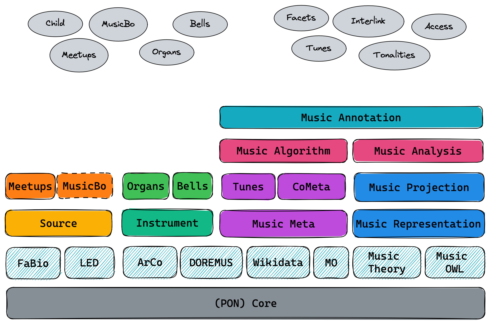

# Knowledge Engineering project
Team “Antonio & Daniele”:
- Antonio Politano <antonio.politano2@studio.unibo.it>
- Daniele Santini <daniele.santini2@studio.unibo.it>

## Assignment
Project 4 - Matching ontologies in the music domain
Tutor: 
- Valentina Carriero <valentina.carriero3@unibo.it>
- Jacopo de Berardinis <jacopo.deberardinis@kcl.ac.uk>
- Valentina Presutti <valentina.presutti@unibo.it>

### General tasks
From [Projects2223.pdf](./Projects2223.pdf), page 5
1. Analysis of existing datasets using heterogeneous formats, to produce RDF knowledge graphs
2. Application of the eXtreme Design methodology (competency questions, ODP reuse, testing, etc.) to develop OWL ontologies for the knowledge graphs
3. Definition of mapping rules for transforming input data into semantic web knowledge graphs, according to the developed ontologies (e.g., SPARQLAnything)
4. Generation of URIs and publication of ontologies and knowledge graphs (with permanent URIs)
5. Application/use/configuration of tools for entity linking and ontology alignment
6. Use of large language models
7. Publication of a SPARQL endpoint
8. Integration of LODView for knowledge graph browsing and LODE for producing human-readable documentation of the ontologies Ex. https://github.com/anuzzolese/OntoPiA-UI
9. Creation of a docker that will contain data, software, SPARQL endpoint, website and all the necessary dependencies
10. Report writing with a description of the project, remarking the applied methodology, the addressed the challenges, the adopted solutions, and the obtained results.

### Project assignment
From [Projects2223.pdf](./Projects2223.pdf), page 18

In the Polifonia project, we are developing a network of ontologies on the music domain.
This ontology network (PON, [link](https://github.com/polifonia-project/ontology-network/)) is composed of different ontology modules, addressing a specific thematic area of the domain (e.g. a module is specifically related to bells and bell towers).

In order to support interoperability, such ontologies should be aligned to existing (music-related) ontologies.
Ontology matching (OM) can be defined as the process of finding correspondences (i.e. mappings, alignments) between entities belonging to different ontologies.

In this project, you will generate a set of alignments between the modules developed inside Polifonia and relevant state-of-the-art ontologies.

## Other ontologies
Based on Polifonia:
* [smashub/choco](https://github.com/smashub/choco), based on Polifonia

Other ontologies:
* Main target for alignment: [Wikidata](https://www.wikidata.org/wiki/Wikidata:WikiProject_Music)
* Nice to have: [Music Ontology](http://musicontology.com/)
* Nice to have: [DOREMUS](https://data.doremus.org/ontology/)

Full list: [link](https://github.com/polifonia-project/ontology-network/blob/5e90aefa25217547eddd4816bdae719b0e52daac/resources/d21-ontologies.pdf), [rotated version](./d21-ontologies.pdf) (source: [deliverable 2](https://polifonia-project.eu/wp-content/uploads/2022/01/Polifonia_D2.1_V1.0.pdf), section 6.2)

## Methods

* Manual
* Automatic (rule-based)
    * AgreementMakerLight
        * [AgreementMakerLight/AML-Project](https://github.com/AgreementMakerLight/AML-Project) on GitHub
        * [paper](https://www.semantic-web-journal.net/content/agreementmakerlight-0)
    * LogMap
        * [Web front-end](http://krrwebtools.cs.ox.ac.uk/logmap/)
        * [Website](https://www.cs.ox.ac.uk/isg/tools/LogMap/)
        * [ernestojimenezruiz/logmap-matcher](https://github.com/ernestojimenezruiz/logmap-matcher) on GitHub
        * [paper](https://www.cs.ox.ac.uk/isg/projects/LogMap/papers/paper_ISWC2011.pdf)
* Automatic (ML-based)
    * BERTMap: A BERT-based Ontology Alignment System
        * [Paper](https://arxiv.org/abs/2112.02682) on ArXiV
        * [KRR-Oxford/BERTMap](https://github.com/KRR-Oxford/BERTMap) on GitHub
       * Now maintained under DeepOnto
          * [Website](https://krr-oxford.github.io/DeepOnto/)
          * [BERTMap under DeepOnto](https://krr-oxford.github.io/DeepOnto/bertmap/)
          * [KRR-Oxford/DeepOnto](https://github.com/KRR-Oxford/DeepOnto) on GitHub

Other resources:
* [Ontology Alignment on ResearchGate](https://www.researchgate.net/topic/Ontology-Alignment/publications)
* [ontologymatching.org](http://www.ontologymatching.org/index.html)
* Owl2Vec*
    * [Website](https://owl2vec-star.readthedocs.io/en/latest/readme.html)
    * [KRR-Oxford/OWL2Vec-Star](https://github.com/KRR-Oxford/OWL2Vec-Star) on GitHub
    * [Paper](https://arxiv.org/abs/2009.14654) on ArXiV

## Polifonia

### Updated version

* [Ontology specification](./Polifonia_D2.1_V1.0.pdf)
* [polifonia-project/ontology-network](https://github.com/polifonia-project/ontology-network/) on GitHub
* [polifonia.owl](./polifonia.owl) ([download script](./polifonia-download-owl.sh))

Ontology modules:

| **Ontology**             | **Prefix** | **Description**                                                                                | **URI**                                                   | **Repository**                                                     |
|--------------------------|------------|------------------------------------------------------------------------------------------------|-----------------------------------------------------------|--------------------------------------------------------------------|
| **FULL**                 | pon:       | The FULL ontology module stored in this repository, which imports all the modules listed here. | https://w3id.org/polifonia/ontology/ontology-network/     | https://github.com/polifonia-project/ontology-network/             |
| **Core**                 | core:      | Elements of general reuse and ontology design patterns.                                        | https://w3id.org/polifonia/ontology/core/                 | https://github.com/polifonia-project/core-ontology                 |
| **Music Meta**           | mm:        | Achieving interoperability of music metadata.                                                  | https://w3id.org/polifonia/ontology/music-meta/           | https://github.com/polifonia-project/musicmeta-ontology            |
| **Music Representation** | mr:        | Foundational model to describe arbitrary musical content.                                      | https://w3id.org/polifonia/ontology/music-representation/ | https://github.com/polifonia-project/music-representation-ontology |
| **Music Instrument**     | mop:       | Instruments and their evolution through time and space.                                        | https://w3id.org/polifonia/ontology/instrument/           | https://github.com/polifonia-project/instrument-ontology           |
| **Source**               | src:       | Representing musical sources and their context of production.                                  | https://w3id.org/polifonia/ontology/source/               | https://github.com/polifonia-project/source-ontology               |
| **Tunes**                | tunes:     | A specialisation of Music Meta for folk music.                                                 | https://w3id.org/polifonia/ontology/tunes/                | https://github.com/polifonia-project/tunes-ontology                |
| **CoMeta**               | com:       | An extension of Music Meta to represent music corpora.                                         | https://w3id.org/polifonia/ontology/cometa/               | https://github.com/polifonia-project/cometa-ontology               |
| **Music Projection**     | mp:        | Achieving interoperability of music notation systems.                                          | https://w3id.org/polifonia/ontology/music-projection/     | https://github.com/polifonia-project/music-projection-ontology     |
| **Organs**               | organ:     | A rich descriptive model of organs and building methods.                                       | https://w3id.org/polifonia/ontology/organs/                | https://github.com/polifonia-project/organs-ontology               |
| **Bells**                | bell:      | Describing bells, bell towers and bell ringers.                                                | https://w3id.org/polifonia/ontology/bells/                 | https://github.com/polifonia-project/bells-ontology                 |
| **Music Algorithm**     | mx:        | Computational methods for music and their parametrisation.                                     | https://w3id.org/polifonia/ontology/music-algorithm/      | https://github.com/polifonia-project/music-algorithm-ontology      |
| **Music Analysis**      | ma:        | Music analysis through reasoning using modal-tonal theories.                                   | https://w3id.org/polifonia/ontology/music-analysis/        | https://github.com/polifonia-project/music-analysis-ontology       |
| **Music Annotation**    | ann:       | A wrapper of ontologies for music annotations (audio, symbolic).                               | https://w3id.org/polifonia/ontology/music-annotation/     | https://github.com/polifonia-project/music-annotation-ontology     |

Some alignments have already been established in the above ontologies through owl:equivalentClass and rdfs:subClassOf.

### Knowledge Graphs based on Polifonia

* ChoCo (Chord Corpus):
    * [smashub/choco](https://github.com/smashub/choco) on GitHub
    * [Website](https://polifonia.disi.unibo.it/choco/)
    * [SPARQL endpoint](https://polifonia.disi.unibo.it/choco/query)
* Tunes KG: [SPARQL Endpoint](https://polifonia.disi.unibo.it/tunes/sparql)
* Organs KG: [SPARQL Endpoint](https://polifonia.disi.unibo.it/organs/sparql)

### !! OUTDATED version !!

Click to open

[Diagram](./modules.png)

From [the deliverable 2](https://polifonia-project.eu/wp-content/uploads/2022/01/Polifonia_D2.1_V1.0.pdf), page 13, and [the top level ontology](https://github.com/polifonia-project/ontology-network/blob/5e90aefa25217547eddd4816bdae719b0e52daac/ontology/ontology-network.owl)

Ontology Module | Prefix | Declared repository | Actual repository | URI
-----|-----|-----|-----|-----
Full | full: | [ontology-network](https://github.com/polifonia-project/ontology-network) | [ontology-network](https://github.com/polifonia-project/ontology-network) | https://w3id.org/polifonia/ontology/ontology-network/1.0/
Core | core: | [core](https://github.com/polifonia-project/core) | [core-ontology](https://github.com/polifonia-project/core-ontology) | https://w3id.org/polifonia/ontology/core/
Musical Composition | mc: | [musical-composition](https://github.com/polifonia-project/musical-composition) | ??? | ???
Musical Performance | mp: | [musical-performance](https://github.com/polifonia-project/musical-performance) | ??? | ???
Musical Feature | mf: | [musical-feature](https://github.com/polifonia-project/musical-feature) | ??? | ???
Music Emotion | me: | [music-emotion](https://github.com/polifonia-project/music-emotion) | [music-emotion-ontology](https://github.com/polifonia-project/music-emotion-ontology) | ???
Bell | bell: | [bell](https://github.com/polifonia-project/bell) | [bells-ontology](https://github.com/polifonia-project/bells-ontology) | https://w3id.org/polifonia/ontology/bells/
Source | src: | [source](https://github.com/polifonia-project/source) | [source-ontology](https://github.com/polifonia-project/source-ontology) | https://w3id.org/polifonia/ontology/source/
Instrument | inst: | [instrument](https://github.com/polifonia-project/instrument) | [music-instrument-ontology](https://github.com/polifonia-project/music-instrument-ontology) | https://w3id.org/polifonia/ontology/instrument/
Comparative Measure | cm: | [comparative-measure/](https://github.com/polifonia-project/comparative-measure/) | ??? | ???
Metadata | md: | [metadata](https://github.com/polifonia-project/metadata) | [cometa-ontology](https://github.com/polifonia-project/cometa-ontology) | https://w3id.org/polifonia/ontology/cometa/
Music Annotation | ? | NO | [music-annotation-ontology](https://github.com/polifonia-project/music-annotation-ontology) | https://w3id.org/polifonia/ontology/music-annotation/
Music Algorithm | ? | NO | [music-algorithm-ontology](https://github.com/polifonia-project/music-algorithm-ontology) | https://w3id.org/polifonia/ontology/music-algorithm/
Music Analysis | ? | NO | [music-analysis-ontology](https://github.com/polifonia-project/music-analysis-ontology) | https://w3id.org/polifonia/ontology/music-analysis/
Music Projection | ? | NO | [music-projection-ontology](https://github.com/polifonia-project/music-projection-ontology) | https://w3id.org/polifonia/ontology/music-projection/
Music Representation | ? | NO | [music-representation-ontology](https://github.com/polifonia-project/music-representation-ontology) | https://w3id.org/polifonia/ontology/music-representation/
Tunes | ? | NO | [tunes-ontology](https://github.com/polifonia-project/tunes-ontology) | https://raw.githubusercontent.com/polifonia-project/tunes-ontology/main/ontology/tunes.owl

## Wikidata

* [Home](https://www.wikidata.org/wiki/Wikidata:Main_Page)
* [WikiProject Music](https://www.wikidata.org/wiki/Wikidata:WikiProject_Music)
* [Our workspace](https://www.wikidata.org/wiki/User:Danysan1/Polifonia-Wikidata_matching)
* [Data sccess documentation](https://www.wikidata.org/wiki/Wikidata:Data_access)
    * [SPARQL Documentation](https://www.wikidata.org/wiki/Wikidata:SPARQL_query_service/Wikidata_Query_Help)
    * [SPARQL Endpoint](https://query.wikidata.org/)
    * RDF dump
        * [Documentation](https://www.wikidata.org/wiki/Wikidata:Database_download#RDF_dumps)
        * Follows [Wikibase RDF dump format documentation](https://www.mediawiki.org/wiki/Wikibase/Indexing/RDF_Dump_Format)
        * [Dump files index](https://dumps.wikimedia.org/wikidatawiki/entities/)
* Built upon [Wikibase](https://wikiba.se/)'s ontology ( http://wikiba.se/ontology-1.0.owl ) but its ontology is not structured nor available in OWL

## Music Ontology

* [Website](http://musicontology.com/)
* [Specification](http://musicontology.com/specification/)
* [music-ontology.owl](./music-ontology.owl) ([fetch script](./music-ontology-dowload-owl.sh))
