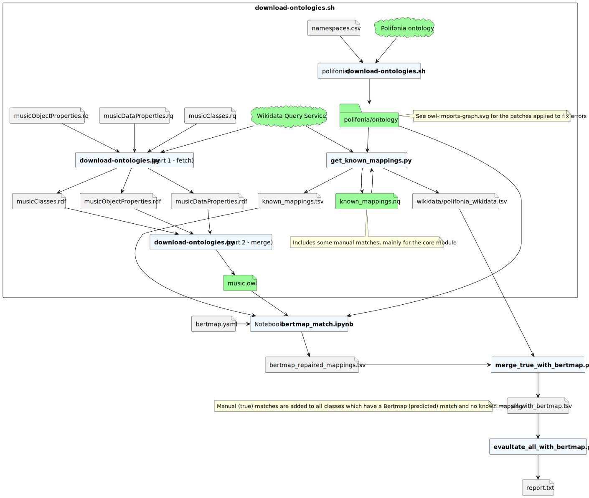

# Knowledge Engineering project

Team “Antonio & Daniele”:

- Antonio Politano ([S1082351](https://github.com/S1082351))
- Daniele Santini ([Danysan1](https://github.com/Danysan1))

Project 4 - Matching ontologies in the music domain

Tutor: Valentina Carriero, Jacopo de Berardinis, Valentina Presutti

## Project assignment
From [Projects2223.pdf](./Projects2223.pdf), page 18

In the Polifonia project, we are developing a network of ontologies on the music domain.
This ontology network (PON, [link](https://github.com/polifonia-project/ontology-network/)) is composed of different ontology modules, addressing a specific thematic area of the domain (e.g. a module is specifically related to bells and bell towers).

In order to support interoperability, such ontologies should be aligned to existing (music-related) ontologies.
Ontology matching (OM) can be defined as the process of finding correspondences (i.e. mappings, alignments) between entities belonging to different ontologies.

In this project, you will generate a set of alignments between the modules developed inside Polifonia and relevant state-of-the-art ontologies.

## Analysis
### Ontologies

* [Polifonia](./polifonia/)
* [ChoCo](https://github.com/smashub/choco), based on Polifonia
* Main target for alignment: [Wikidata](./wikidata)
* Nice to have: [Music Ontology](./music-ontology/)
* Nice to have: [DOREMUS](./doremus/)

Full list: [link](https://github.com/polifonia-project/ontology-network/blob/5e90aefa25217547eddd4816bdae719b0e52daac/resources/d21-ontologies.pdf), [rotated version](./d21-ontologies.pdf) (source: [deliverable 2](https://polifonia-project.eu/wp-content/uploads/2022/01/Polifonia_D2.1_V1.0.pdf), section 6.2)

### Methods

* Manual
* Automatic (rule-based)
    * AgreementMakerLight
        * [AgreementMakerLight/AML-Project](https://github.com/AgreementMakerLight/AML-Project) on GitHub
        * [paper](https://www.semantic-web-journal.net/content/agreementmakerlight-0)
    * LogMap
        * [Web front-end](http://krrwebtools.cs.ox.ac.uk/logmap/)
        * [Website](https://www.cs.ox.ac.uk/isg/tools/LogMap/)
        * [ernestojimenezruiz/logmap-matcher](https://github.com/ernestojimenezruiz/logmap-matcher) on GitHub
        * [paper](https://www.cs.ox.ac.uk/isg/projects/LogMap/papers/paper_ISWC2011.pdf)
* Automatic (ML-based)
    * BERTMap: A BERT-based Ontology Alignment System
        * [Paper](https://arxiv.org/abs/2112.02682) on ArXiV
        * [KRR-Oxford/BERTMap](https://github.com/KRR-Oxford/BERTMap) on GitHub
        * Now maintained under DeepOnto
            * [Website](https://krr-oxford.github.io/DeepOnto/)
            * [BERTMap under DeepOnto](https://krr-oxford.github.io/DeepOnto/bertmap/)
            * [KRR-Oxford/DeepOnto](https://github.com/KRR-Oxford/DeepOnto) on GitHub
* Abandoned
    * AgreementMaker
        * [Website](https://agreementmaker.github.io/)
        * [agreementmaker/agreementmaker](https://github.com/agreementmaker/agreementmaker) on GitHub

Other resources:
* [Ontology Alignment on ResearchGate](https://www.researchgate.net/topic/Ontology-Alignment/publications)
* [ontologymatching.org](http://www.ontologymatching.org/index.html)
* Owl2Vec*
    * [Website](https://owl2vec-star.readthedocs.io/en/latest/readme.html)
    * [KRR-Oxford/OWL2Vec-Star](https://github.com/KRR-Oxford/OWL2Vec-Star) on GitHub
    * [Paper](https://arxiv.org/abs/2009.14654) on ArXiV

# Execution:

We choose to execute the matching between Wikidata and Polifonia using BertMap.

## Download the music ontology from Wikidata:

1. Creating the SPARQL queries [described on this page](https://www.wikidata.org/wiki/User:Danysan1/Polifonia-Wikidata_matching) ([musicClasses.rq](wikidata/musicClasses.rq), [musicDataProperties.rq](wikidata/musicDataProperties.rq) and [musicObjectProperties.rq](wikidata/musicObjectProperties.rq))
2. Execute these queries and merge them in [music.owl](wikidata/ontology/music.owl) with [download-ontologies.py](wikidata/download-ontologies.py)

The result includes [12'257](https://www.wikidata.org/wiki/User:Danysan1/Polifonia-Wikidata_matching#Result_count) classes out of about [4'013'595](https://www.wikidata.org/wiki/User:Danysan1/Polifonia-Wikidata_matching#Total_class_count) total Wikidata classes.

## Download the full Polifonia ontology network

1. List the base URIs of all ontologies in the Polifonia network and their respective (recursively) dependencies (ontologies imported through owl:imports) are listed in [namespaces.csv](polifonia/namespaces.csv)
2. Run [polifonia/download-ontologies.sh](polifonia/download-ontologies.sh) to download all ontologies listed in [namespaces.csv](polifonia/namespaces.csv) into [polifonia/ontology](polifonia/ontology)
3. Edit the Polifona ontology to fix the import problems that were preventing BertMap from loading the ontologies (see [owl-imports-graph.svg](polifonia/owl-imports-graph.svg)), including:
    - Broken links (dead domains, missing files, unreliable domains, ontology URIs that even when called with `Accept: application/rdf+xml` return an HTML page)
    - Imports to the same ontology by multiple other ontologies where OWLAPI does not accept it
4. Initialize [known_mappings.nq](./known_mappings.nq) with the knwon mappings from the ontology network using [get_known_mappings.py](./get_known_mappings.py)
5. Add to [known_mappings.nq](./known_mappings.nq) other known mappings found manually, using `<https://github.com/Danysan1/unibo-ke-matching-ontologies/manual-matches/>` as graph label (last column)
6. Run again [get_known_mappings.py](./get_known_mappings.py) to create [polifonia_wikidata.tsv](wikidata/polifonia_wikidata.tsv) (meant to be easily read by humans) and [known_mappings.tsv](./known_mappings.tsv) (required by BertMap)

## Run BertMap

1. Create [bertmap.yaml](wikidata/bertmap.yaml)
2. Run bertmap in [bertmap_match.ipynb](wikidata/bertmap_match.ipynb) passing as input the files created above:
    - [bertmap.yaml](wikidata/bertmap.yaml)
    - [known_mappings.tsv](./known_mappings.tsv)
    - [music.owl](wikidata/ontology/music.owl)
    - all files in [polifonia/ontology](polifonia/ontology)
3. Extract the result ([bertmap_repaired_mappings.tsv](wikidata/bertmap_repaired_mappings.tsv))
4. Execute [merge_true_with_bertmap.py](wikidata/merge_true_with_bertmap.py) to merge the true (known) mappings and the predicted into [all_with_bertmap.tsv](wikidata/all_with_bertmap.tsv)
5. Execute [evaluate_all_with_bertmap.tsv](wikidata/evaluate_all_with_bertmap.tsv) to generate a classification report into [report.txt](wikidata/report.txt)

