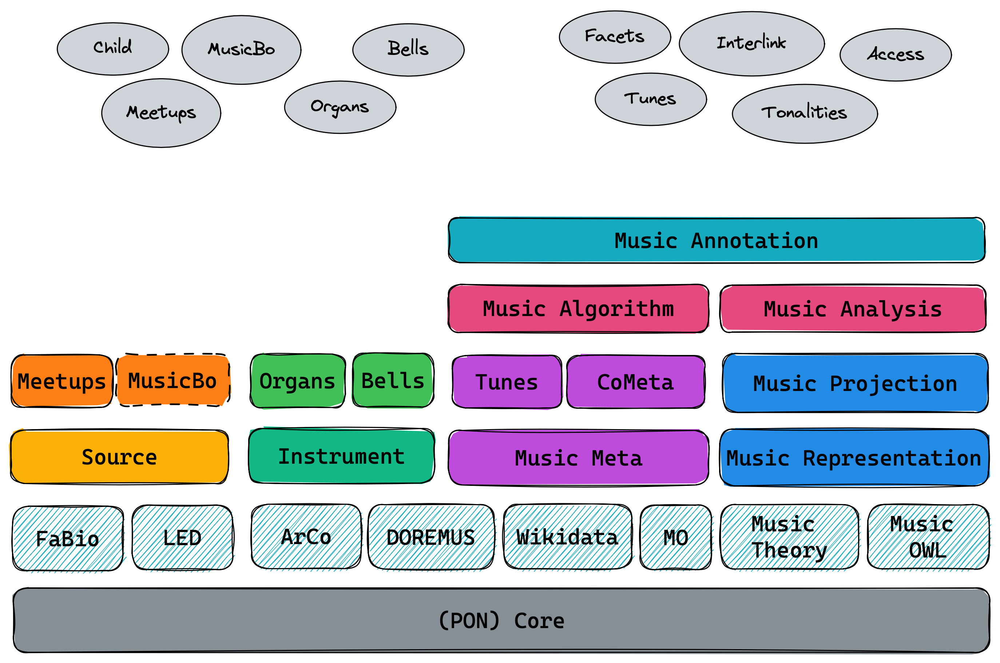

# Polifonia

### Updated version

* [Ontology specification](./Polifonia_D2.1_V1.0.pdf)
* [polifonia-project/ontology-network](https://github.com/polifonia-project/ontology-network/) on GitHub
* [OWL ontology](./ontology/ontology-network.owl)
* URI: https://w3id.org/polifonia/ontology/ontology-network/

Ontology modules:

| **Ontology**             | **Prefix** | **Description**                                                                                | **URI**                                                   | **Repository**                                                     |
|--------------------------|------------|------------------------------------------------------------------------------------------------|-----------------------------------------------------------|--------------------------------------------------------------------|
| **FULL**                 | pon:       | The FULL ontology module stored in this repository, which imports all the modules listed here. | https://w3id.org/polifonia/ontology/ontology-network/     | https://github.com/polifonia-project/ontology-network/             |
| **Core**                 | core:      | Elements of general reuse and ontology design patterns.                                        | https://w3id.org/polifonia/ontology/core/                 | https://github.com/polifonia-project/core-ontology                 |
| **Music Meta**           | mm:        | Achieving interoperability of music metadata.                                                  | https://w3id.org/polifonia/ontology/music-meta/           | https://github.com/polifonia-project/musicmeta-ontology            |
| **Music Representation** | mr:        | Foundational model to describe arbitrary musical content.                                      | https://w3id.org/polifonia/ontology/music-representation/ | https://github.com/polifonia-project/music-representation-ontology |
| **Music Instrument**     | mop:       | Instruments and their evolution through time and space.                                        | https://w3id.org/polifonia/ontology/music-instrument/           | https://github.com/polifonia-project/music-instrument-ontology           |
| **Source**               | src:       | Representing musical sources and their context of production.                                  | https://w3id.org/polifonia/ontology/source/               | https://github.com/polifonia-project/source-ontology               |
| **Tunes**                | tunes:     | A specialisation of Music Meta for folk music.                                                 | https://w3id.org/polifonia/ontology/tunes/                | https://github.com/polifonia-project/tunes-ontology                |
| **CoMeta**               | com:       | An extension of Music Meta to represent music corpora.                                         | https://w3id.org/polifonia/ontology/cometa/               | https://github.com/polifonia-project/cometa-ontology               |
| **Music Projection**     | mp:        | Achieving interoperability of music notation systems.                                          | https://w3id.org/polifonia/ontology/music-projection/     | https://github.com/polifonia-project/music-projection-ontology     |
| **Organs**               | organ:     | A rich descriptive model of organs and building methods.                                       | https://w3id.org/polifonia/ontology/organs/                | https://github.com/polifonia-project/organs-ontology               |
| **Bells**                | bell:      | Describing bells, bell towers and bell ringers.                                                | https://w3id.org/polifonia/ontology/bells/                 | https://github.com/polifonia-project/bells-ontology                 |
| **Music Algorithm**     | mx:        | Computational methods for music and their parametrisation.                                     | https://w3id.org/polifonia/ontology/music-algorithm/      | https://github.com/polifonia-project/music-algorithm-ontology      |
| **Music Analysis**      | ma:        | Music analysis through reasoning using modal-tonal theories.                                   | https://w3id.org/polifonia/ontology/music-analysis/        | https://github.com/polifonia-project/music-analysis-ontology       |
| **Music Annotation**    | ann:       | A wrapper of ontologies for music annotations (audio, symbolic).                               | https://w3id.org/polifonia/ontology/music-annotation/     | https://github.com/polifonia-project/music-annotation-ontology     |

Some alignments have already been established in the above ontologies through owl:equivalentClass and rdfs:subClassOf.

### Knowledge Graphs based on Polifonia

* ChoCo (Chord Corpus):
    * [smashub/choco](https://github.com/smashub/choco) on GitHub
    * [Website](https://polifonia.disi.unibo.it/choco/)
    * [SPARQL endpoint](https://polifonia.disi.unibo.it/choco/query)
* Tunes KG: [SPARQL Endpoint](https://polifonia.disi.unibo.it/tunes/sparql)
* Organs KG: [SPARQL Endpoint](https://polifonia.disi.unibo.it/organs/sparql)

### Old vrsion

Click to open the details of the OLD OUTDATED version

[Diagram](./modules.png)

From [the deliverable 2](https://polifonia-project.eu/wp-content/uploads/2022/01/Polifonia_D2.1_V1.0.pdf), page 13, and [the top level ontology](https://github.com/polifonia-project/ontology-network/blob/5e90aefa25217547eddd4816bdae719b0e52daac/ontology/ontology-network.owl)

Ontology Module | Prefix | Declared repository | Actual repository | URI
-----|-----|-----|-----|-----
Full | full: | [ontology-network](https://github.com/polifonia-project/ontology-network) | [ontology-network](https://github.com/polifonia-project/ontology-network) | https://w3id.org/polifonia/ontology/ontology-network/1.0/
Core | core: | [core](https://github.com/polifonia-project/core) | [core-ontology](https://github.com/polifonia-project/core-ontology) | https://w3id.org/polifonia/ontology/core/
Musical Composition | mc: | [musical-composition](https://github.com/polifonia-project/musical-composition) | ??? | ???
Musical Performance | mp: | [musical-performance](https://github.com/polifonia-project/musical-performance) | ??? | ???
Musical Feature | mf: | [musical-feature](https://github.com/polifonia-project/musical-feature) | ??? | ???
Music Emotion | me: | [music-emotion](https://github.com/polifonia-project/music-emotion) | [music-emotion-ontology](https://github.com/polifonia-project/music-emotion-ontology) | ???
Bell | bell: | [bell](https://github.com/polifonia-project/bell) | [bells-ontology](https://github.com/polifonia-project/bells-ontology) | https://w3id.org/polifonia/ontology/bells/
Source | src: | [source](https://github.com/polifonia-project/source) | [source-ontology](https://github.com/polifonia-project/source-ontology) | https://w3id.org/polifonia/ontology/source/
Instrument | inst: | [instrument](https://github.com/polifonia-project/instrument) | [music-instrument-ontology](https://github.com/polifonia-project/music-instrument-ontology) | https://w3id.org/polifonia/ontology/instrument/
Comparative Measure | cm: | [comparative-measure/](https://github.com/polifonia-project/comparative-measure/) | ??? | ???
Metadata | md: | [metadata](https://github.com/polifonia-project/metadata) | [cometa-ontology](https://github.com/polifonia-project/cometa-ontology) | https://w3id.org/polifonia/ontology/cometa/
Music Annotation | ? | NO | [music-annotation-ontology](https://github.com/polifonia-project/music-annotation-ontology) | https://w3id.org/polifonia/ontology/music-annotation/
Music Algorithm | ? | NO | [music-algorithm-ontology](https://github.com/polifonia-project/music-algorithm-ontology) | https://w3id.org/polifonia/ontology/music-algorithm/
Music Analysis | ? | NO | [music-analysis-ontology](https://github.com/polifonia-project/music-analysis-ontology) | https://w3id.org/polifonia/ontology/music-analysis/
Music Projection | ? | NO | [music-projection-ontology](https://github.com/polifonia-project/music-projection-ontology) | https://w3id.org/polifonia/ontology/music-projection/
Music Representation | ? | NO | [music-representation-ontology](https://github.com/polifonia-project/music-representation-ontology) | https://w3id.org/polifonia/ontology/music-representation/
Tunes | ? | NO | [tunes-ontology](https://github.com/polifonia-project/tunes-ontology) | https://raw.githubusercontent.com/polifonia-project/tunes-ontology/main/ontology/tunes.owl

